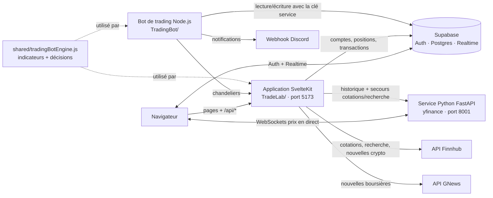

<div align="center">


# TradeLab

**Simulateur boursier : perfectionnez vos stratégies d'investissement sans aucun risque financier.**

Chaque utilisateur reçoit un portefeuille virtuel de **100 000 $**. Il peut acheter et vendre des actions et des cryptomonnaies au prix du marché, suivre ses gains, lire l'actualité financière et confier son compte à un **bot de trading automatique**.


</div>

> [!NOTE]
> TradeLab est un projet scolaire. Toutes les transactions sont **simulées** : aucun ordre n'est envoyé à un vrai courtier, et rien dans l'application ne constitue un conseil financier.

---

## Sommaire

- [Fonctionnalités](#fonctionnalités)
- [Architecture](#architecture)
- [Structure du dépôt](#structure-du-dépôt)
- [Installation](#installation)
- [Variables d'environnement](#variables-denvironnement)
- [Fonctionnement du bot de trading](#fonctionnement-du-bot-de-trading)
- [Tests](#tests)
- [Sécurité](#sécurité)
- [Limites connues](#limites-connues)
- [Documentation complémentaire](#documentation-complémentaire)

---

## Fonctionnalités

| Page | Ce qu'on peut y faire |
|---|---|
| **Portefeuille** | Solde total et disponible, titres possédés avec gain/perte, historique des transactions, graphique d'évolution du solde, ajout de fonds virtuels. |
| **Marchés** | Recherche d'actions et de cryptos, liste de surveillance (watchlist) et historique des titres consultés. |
| **Fiche d'un titre** | Prix en direct, graphique en chandeliers (de 1 minute à 5 ans), informations sur l'entreprise, formulaire d'achat et de vente. |
| **Actualités** | Nouvelles boursières en français (GNews) et nouvelles crypto (Finnhub), affichées dès l'ouverture de la page puis mises en cache 10 minutes. |
| **Trading Bot** | Activation du bot, choix des symboles à trader, réglage des paramètres de stratégie et journal des actions du bot en temps réel. |

Autres points :

- **Heures de marché réalistes** : les actions ne s'échangent que pendant les heures d'ouverture du NYSE (9 h 30 à 16 h, heure de New York, jours fériés exclus). Les cryptomonnaies s'échangent 24 h/24, 7 j/7.
- **Authentification** par courriel et mot de passe (Supabase Auth). À l'inscription, le mot de passe doit être complexe, et une validation en direct l'indique.
- **Notifications Discord** (optionnelles) à chaque achat ou vente du bot.
- **Thèmes** : sombre (par défaut), clair ou noir.

---

## Architecture

TradeLab est composé de **trois programmes** qui partagent une même base de données Supabase :



| Programme | Dossier | Rôle |
|---|---|---|
| **Application web** | `TradeLab/` | Interface (Svelte 5) et API interne (`src/routes/api/*`). Gère l'authentification, les comptes, les achats et ventes. |
| **Service de données de marché** | `TradeLab/backend/` | API FastAPI qui interroge Yahoo Finance (yfinance) : recherche de symboles, cotations, historiques et WebSockets de prix en temps réel. |
| **Bot de trading** | `TradingBot/` | Processus Node.js indépendant du navigateur : il analyse le marché pour les utilisateurs qui ont activé le bot et passe des ordres simulés. |
| **Moteur d'analyse** | `shared/` | Calcul des indicateurs techniques et prise de décision, partagé entre le bot et l'application. |

---

## Structure du dépôt

```
TradeLab/                       ← racine du dépôt
├── TradeLab/                   # Application SvelteKit + service Python
│   ├── src/
│   │   ├── routes/             # Pages (/, /markets, /news, /trading-bot, /stock/[symbol], /login)
│   │   │   └── api/            # API interne : account, stock, symbols, settings, trading-bot, auth
│   │   ├── lib/
│   │   │   ├── components/     # Composants Svelte (AuthPage, StockDetail, TradeForm…)
│   │   │   ├── services/       # Logique métier (accountService) et clients WebSocket
│   │   │   ├── stores/         # État partagé (compte, marché, portefeuille)
│   │   │   ├── utils/          # Validation, normalisation des données
│   │   │   └── sql/schema.sql  # Schéma de la base Supabase
│   │   └── hooks.server.ts     # Session Supabase + protection des routes
│   ├── backend/                # Service FastAPI (yfinance, WebSockets, proxies)
│   ├── start_api.py            # Point d'entrée du service Python
│   ├── requirements.txt
│   └── docs/                   # Documentation technique détaillée
├── TradingBot/
│   └── bot.js                  # Bot de trading automatique
├── shared/
│   ├── tradingBotEngine.js     # Indicateurs techniques et décisions
│   └── tradingBotEngine.test.js
└── .vscode/tasks.json          # Tâche « run: all » pour tout lancer en un clic
```

---

## Installation

### Prérequis

- **Node.js** 20.19 ou plus récent (ou 22.12+)
- **Python** 3.12
- Un projet **[Supabase](https://supabase.com)** (gratuit)
- Une clé API **[Finnhub](https://finnhub.io)** et une clé **[GNews](https://gnews.io)** (forfaits gratuits suffisants)

### 1. Cloner le dépôt

```bash
git clone https://github.com/ThomasDarsigny/TradeLab.git
cd TradeLab
```

### 2. Préparer la base de données

Dans votre projet Supabase, ouvrez **SQL Editor** et exécutez le contenu de [`TradeLab/src/lib/sql/schema.sql`](TradeLab/src/lib/sql/schema.sql). Il crée :

- les tables `accounts`, `positions`, `transactions`, `user_settings` et `bot_actions` ;
- leurs règles de sécurité (RLS) ;
- les fonctions `open_position_atomic` et `close_position_atomic`, que le bot utilise pour acheter et vendre sans risque de double transaction.

### 3. Configurer les variables d'environnement

Créez `TradeLab/.env` et `TradingBot/.env` (voir [Variables d'environnement](#variables-denvironnement)).

### 4. Lancer le service Python (port 8001)

```bash
python -m venv .venv
# Windows
.venv\Scripts\activate
# macOS / Linux
source .venv/bin/activate

pip install -r TradeLab/requirements.txt
cd TradeLab
python start_api.py
```

La documentation interactive du service est ensuite disponible sur <http://127.0.0.1:8001/docs>.

### 5. Lancer l'application web (port 5173)

```bash
cd TradeLab
npm install
npm run dev
```

Ouvrez <http://localhost:5173>, créez un compte, puis connectez-vous : votre portefeuille virtuel de 100 000 $ est créé automatiquement.

### 6. Lancer le bot de trading (optionnel)

```bash
cd TradingBot
npm install
npm start
```

Le bot ne trade que pour les utilisateurs qui l'ont activé depuis la page **Trading Bot**.

> [!TIP]
> Dans VS Code, la tâche **`run: all`** (`Terminal › Run Task…`) démarre les trois programmes en parallèle. Elle suppose que l'environnement Python se trouve dans `.venv/` à la racine du dépôt.

---

## Variables d'environnement

Les fichiers `.env` sont ignorés par Git : ne les committez jamais.

### `TradeLab/.env`

| Variable | Obligatoire | Description |
|---|:---:|---|
| `PUBLIC_SUPABASE_URL` | ✅ | URL du projet Supabase |
| `PUBLIC_SUPABASE_ANON_KEY` | ✅ | Clé publique (anon) de Supabase |
| `PUBLIC_FINNHUB_API_KEY` | ✅ | Clé Finnhub : cotations, recherche, nouvelles crypto |
| `GNEWS_API_KEY` | ✅ | Clé GNews : nouvelles boursières (utilisée côté serveur uniquement) |

### `TradingBot/.env`

| Variable | Obligatoire | Par défaut | Description |
|---|:---:|---|---|
| `SUPABASE_URL` | ✅ | | URL du projet Supabase |
| `SUPABASE_SERVICE_ROLE_KEY` | ✅ | | Clé **serveur** Supabase (accès complet, à garder secrète) |
| `TRADELAB_API_BASE_URL` | | `http://127.0.0.1:5173` | Adresse de l'application SvelteKit |
| `TRADELAB_BACKEND_BASE_URL` | | `http://127.0.0.1:8001` | Adresse du service Python |
| `BOT_SYMBOLS` | | `BTC-USD` | Symboles par défaut, séparés par des virgules |
| `BOT_RISK_PERCENT` | | `0.01` | Part du capital risquée par trade (1 %) |
| `BOT_DRIVER_INTERVAL_MS` | | `1000` | Fréquence de la boucle principale |
| `DISCORD_WEBHOOK_URL` | | | Webhook Discord pour les notifications de trades |

Les paramètres de stratégie (`BOT_TREND_ADX_MIN`, `BOT_TAKE_PROFIT_PERCENT`, etc.) peuvent aussi être définis ici. Chaque utilisateur peut toutefois les ajuster depuis la page **Trading Bot**.

---

## Fonctionnement du bot de trading

À intervalle régulier, le bot lit la table `user_settings` pour trouver les utilisateurs qui ont activé le bot. Pour chacun d'eux et pour chaque symbole choisi :

1. **Récupération des données** : il télécharge l'historique des prix (chandeliers) via l'API de l'application.
2. **Analyse technique** : `shared/tradingBotEngine.js` calcule plusieurs indicateurs, dont les moyennes mobiles (EMA, SMA), le RSI, l'ADX, l'ATR, les canaux de Donchian et le STC.
3. **Détection du régime de marché** grâce à l'ADX, puis application de la stratégie adaptée :

   | Stratégie | Quand ? | Signal d'achat |
   |---|---|---|
   | `TREND` | Marché en tendance (ADX > 25) | EMA 50 > EMA 200 et prix au-dessus de la SMA 20 |
   | `RANGE_REVERSAL` | Marché sans direction (ADX < 20) | RSI < 40 (survente) et prix au-dessus de l'EMA 50 |
   | `BREAKOUT` | Volume > 1,5 × la moyenne | Prix au sommet du canal de Donchian et STC > 60 |

4. **Sorties de position** : stop-loss (−5 %), prise de profit (+10 %), retournement du STC ou cassure de la moyenne mobile sur 20 périodes.
5. **Gestion du risque** : 1 % du capital risqué par trade, au plus 15 % du portefeuille par position, au plus 3 positions ouvertes, et des frais simulés de 0,2 % par transaction.
6. **Traçabilité** : chaque action est enregistrée dans `bot_actions` et s'affiche en temps réel dans l'interface. Une notification Discord est aussi envoyée si le webhook est configuré.

Le bot respecte les mêmes heures de marché que l'utilisateur : pas d'actions hors des heures du NYSE, cryptos 24/7.

---

## Tests

```bash
# Application web : tests unitaires des endpoints et utilitaires (Vitest)
cd TradeLab
npm test

# Vérification des types TypeScript / Svelte
npm run check

# Moteur du bot (depuis la racine du dépôt)
npm run test:tradingbot
```

---

## Sécurité

- **Isolation des données** : les règles RLS de Supabase garantissent que chaque utilisateur ne voit et ne modifie que son propre compte, ses positions et ses transactions.
- **Routes protégées** : `hooks.server.ts` vérifie la session Supabase à chaque requête. Un visiteur non connecté est redirigé vers `/login`, et les appels à `/api/*` reçoivent une erreur 401.
- **Clés sensibles** : la clé `SUPABASE_SERVICE_ROLE_KEY` n'est utilisée que par le bot, jamais par le navigateur. La clé GNews ne quitte pas le serveur.
- **Proxies** : le service Python peut faire tourner des proxies pour éviter les limites de requêtes de Yahoo Finance (voir [`PROXY_SETUP.md`](TradeLab/docs/PROXY_SETUP.md)). Le fichier `proxy_config.py` est ignoré par Git.

---

## Limites connues

- Le **service Python doit être lancé** pour les graphiques, les prix en temps réel (WebSockets) et le bot. Sans lui, la recherche et les cotations reposent uniquement sur Finnhub, avec moins de résultats.
- Le **forfait gratuit de GNews** est limité en nombre de requêtes par jour. Les nouvelles sont mises en cache 10 minutes pour l'économiser.

---

## Documentation complémentaire

| Document | Contenu |
|---|---|
| [`TradeLab/docs/API.md`](TradeLab/docs/API.md) | Endpoints du service Python |
| [`TradeLab/docs/DEVELOPMENT.md`](TradeLab/docs/DEVELOPMENT.md) | Guide de développement et commandes utiles |
| [`TradeLab/docs/PROXY_SETUP.md`](TradeLab/docs/PROXY_SETUP.md) | Configuration des proxies |
| [`TradingBot/README.md`](TradingBot/README.md) | Détails du bot de trading |

---

<div align="center">

Projet réalisé par [Thomas Darsigny](https://github.com/ThomasDarsigny) dans le cadre du cours *Technologies émergentes*.

</div>
